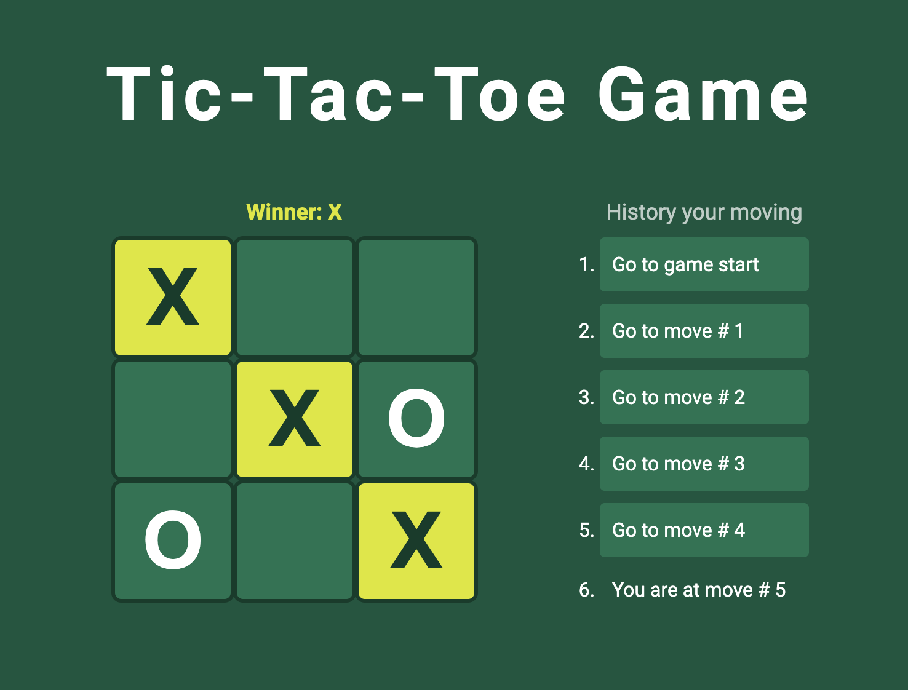

# TIC-TAC-TOE

### [Демо игры](https://kaktusgr.github.io/tic-tac-toe/)

## Описание проекта

Учебный проект интерактивной игры "Крестики-нолики". В проекте использованы React-компоненты, свойства и состояния, JavaScript-функции и события. Собственная реализация оформления при помощи CSS.

Игра включает: 
- игровое поле;
- заголовок с указанием следующего игрока или победителя;
- историю ходов для возвращения к выбранному и обратно.

Самостоятельно реализованный функционал:
- вывод заголовка с указанием победителя либо ничьей (`Winner: X`);
- определение текущего местоположения при перемещении по истории ходов (`You are at move #5`);
- дизайн игры.

## Ссылка на туториал

https://react.dev/learn/tutorial-tic-tac-toe

## Запуск приложения

На вашем компьютере должен быть установлен Node.js и пакетный менеджер `npm`.

В терминале проекта вы можете запустить:

`npm start`

Запускает приложение в режиме разработки.\
Откройте [http://localhost:3000](http://localhost:3000), чтобы просмотреть его в браузере.

`npm run build`

Собирает приложение для производства в папке `build`.